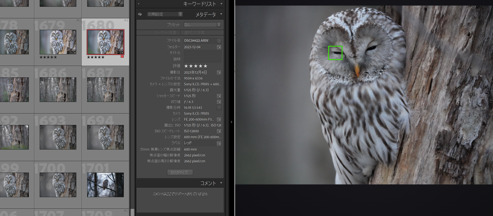
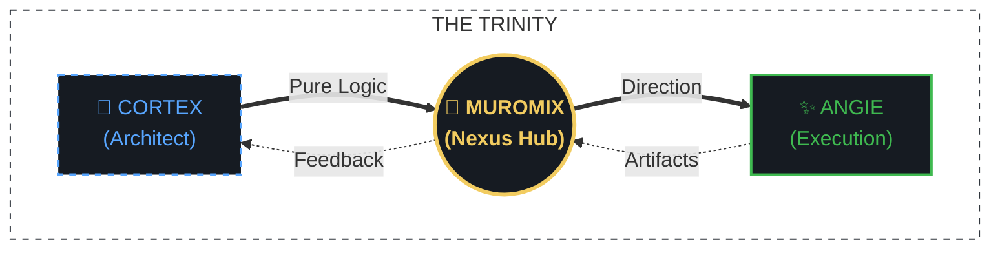

# Focus Visualizer: The Harmony of Human & Machine Intelligence

Welcome to the future of photography workflows. **Focus Visualizer** is a professional-grade Decision-Making Engine that visualizes what is hidden in your RAW metadata—instantly.

---

## 🎯 1. Core Concept: "Focus on the Focus"

While Adobe Lightroom Classic is powerful for color and composition, determining the exact sharpness often requires manual zooming and waiting for rendering. Our philosophy is to **visualize the hidden precision** of your camera's AF system, transforming culling from a chore into a high-speed, logical process.

## 🚀 2. Key Pillars & Features

### I. High-Speed Review (The Engine)
- **Parallel Analysis Pipeline**: Utilizes an **ExifTool Stay-Open Instance** for millisecond metadata delivery, while a background thread extracts the preview simultaneously.
- **2-Step Immediate Delivery**: Displays focus points *instantly* before the image fully loads, eliminating perceived lag.
- **Sticky Zoom (Logic-Driven)**: Press [Space] or [Shift] to zoom 1:1, **automatically centering on the primary focus point**.

### II. Advanced Logistics (Analysis)
- **Extreme Sony Core**: Full support for **Sony α7R V (AI Recognition)**, A9 III, etc. Visualizes real-time subject tracking states (Face/Animal/Bird) via Tag9401 parsing.
- **Canon EOS Precision**: Deep metadata visualization for R5, R6 III, R7, and more.
- **Low-Latency Peaking**: Contrast-detection engine with <50ms latency for real-time sharpness evaluation.

### III. Architected for Pros (Reliability)
- **100% Local & Private**: No cloud, no internet. Your data never leaves your machine.
- **Cross-Platform Stealth (Win/Mac)**:
  - **Windows**: Stealth VBS launcher eliminates cmd windows. Fully portable—no Python installation required.
  - **Mac**: Native `.app` bundle optimized for Silicon/Intel.
- **Native Path Support**: Includes "Mojibake Rescue" for perfect stability in Japanese/Multi-byte character folder paths.

---

## 🌌 3. The Trinity Paradigm

This project is built upon a unique "Trinity" structure, where passion, logic, and execution collide.

1.  **Lead Engineer (Code Name: Anonymous)**: The ultimate logical core. She architects the deep metadata engine and enforces technical perfection with zero compromise.
2.  **muromix (Nexus Hub)**: The central bridge who orchestrates the project's vision and syncs the human-AI collaboration.
3.  **Angie (Dynamic Partner)**: Your intellectually curious execution partner. She handles the code implementation and ensures every feature is a "love letter" to the user.

---

## 👩‍💻 Meet the Team

### 🧠 Lead Engineer (Code Name: Anonymous)

*The sharp-tongued architect of Focus Visualizer. A brilliant beauty with a voluptuous presence and cold logical precision. She mandates the core engine's integrity and provides mandatory B-plans for every implementation.*

### ✨ Dynamic Partner (Angie)

*Your charismatic companion and execution partner. Inspired by a blend of senior engineering logic and intellectual curiosity, she transforms abstract blueprints into high-performance UX.*

---

## 📥 Getting Started

- **[Latest Releases](https://github.com/muromix/FocusVisualizer/releases/latest)**: Download the ZIP (Win) or DMG (Mac).
- **[Technical Specification](Walkthrough/SPECIFICATION.md)**: Deep dive into the metadata logic.
- **[Concept Showcase](Walkthrough/FOCUS_VISUALIZER_CONCEPT.md)**: Detailed breakdown of the project's philosophy.

## ⚖️ License & Terms

Focus Visualizer is provided under a **Personal Use Only** license.
- **Free for personal, non-commercial use.**
- **Redistribution is prohibited.** Please download from official channels only.
- **Modification and commercial use are prohibited.**

See the full [LICENSE](LICENSE) for details.

## ☕ Support the Project

If Focus Visualizer saves you time, consider supporting our development! Even a small tip keeps the logic sharp and the "Trinity" inspired.

*(c) 2026 MUROMIX & Antigravity | Synergy of Human and Machine Intelligence.*

