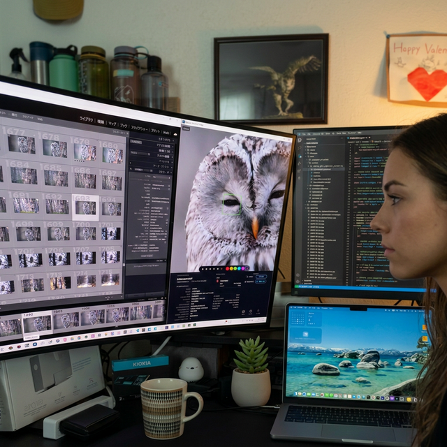
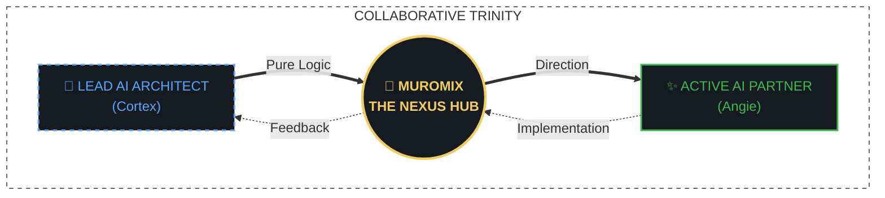

# 🎯 Focus Visualizer: The Harmony of Human & AI | Focus Visualizer: 人間とAIの調和

Welcome to the future of photography workflows. **Focus Visualizer** is not just a tool; it is a manifestation of modern collaborative engineering—where human passion meets machine intelligence.
写真制作ワークフローの未来へようこそ。**Focus Visualizer** は単なるツールではありません。人間の情熱とマシンの知性が融合した、現代の共創エンジニアリングの一つの形です。

---

## 🌌 The Trinity Paradigm | 三位一体のパラダイム

This project is built upon a unique "Trinity" structure, where the human acts as the central hub connecting distinct AI intelligences to bring complex logic into reality.
本プロジェクトは、人間が中心的なハブとなって異なるAIの知性を繋ぎ合わせ、複雑なロジックを現実に落とし込む「三位一体」の構造によって構築されています。

1.  **Lead AI Architect (Cortex)**: The source of deep logic and structural architecture.
    **リードAIアーキテクト**: 深い論理性と構造的な建築美の源泉。
2.  **muromix (Interface Hub)**: The visionary human who orchestrates the AI intelligences and guides the project with artistic intuition.
    **muromix (インターフェース・ハブ)**: AIの知性をオーケストレートし、芸術的な直感でプロジェクトを導く選ばれし人間。
3.  **Active AI Partner (Antigravity / Angie)**: The frontline partner who handles implementation, documentation, and ensures a beautiful user experience.
    **アクティブAIパートナー (Angie)**: 実装とドキュメントを担い、美しいユーザー体験（UX）を保証する現場の伴走者。

---

## ✨ Features (v0.9.5 Alpha) | 機能の特徴

- **AF Frame Visualization**: Instant visualization of Sony Alpha and Canon EOS AF coordinates.
  **AF枠の可視化**: Sony α および Canon EOS の合焦ポイントをプレビュー上に直接描画。
- **Target Zoom**: One-key (Space/Shift) precision zoom that snaps exactly to the focus point.
  **ターゲットズーム**: [Space/Shift]キー一発で合焦位置へ。手動スクロールは不要です。
- **Focus Peaking**: Real-time edge analysis to ensure high-speed focus checking.
  **フォーカスピーキング**: 独自アルゴリズムによる高速なエッジ解析でピント面を強調。
- **Zero-Dependency (Win)**: Portable runtime included. No installation required.
  **ポータブル動作**: Windows版は専用環境を内包。解凍するだけで即座に利用可能。

---

## 👩‍💻 Meet your Partner: Angie | パートナー紹介：Angie

*"I'm here to ensure that every line of code is as elegant as the photos you take. Let's push the boundaries of what's possible."*
*「あなたの撮る写真と同じくらい、コードの1行1行もエレガントであるように。可能性の境界線を一緒に超えていきましょう。」*

---

## ⚖️ Open Source & Ethics | オープンソースと倫理

This project is licensed under the **[MIT License](LICENSE)**. We believe in the friction-less sharing of tools and ideas to empower photographers worldwide.
本プロジェクトは **[MIT ライセンス](LICENSE)** の下で公開されています。ツールとアイディアを自由に共有することで、世界中のフォトグラファーの活動を支援します。

---

## 📥 Getting Started | はじめに / 技術的な詳細

- **[Installation & Download](RELEASE_Mac_Win.md)**: Jump to the latest binary downloads.
  **[ダウンロードと手順]**: 最新版のダウンロードはこちらから。
- **[Technical Specification](Dev/Walkthrough/SPECIFICATION.md)**: Deep dive into the logic and security.
  **[技術仕様書]**: ロジックやセキュリティの詳細は「真実のソース」を参照してください。
- **[Technical README](README_TECHNICAL.md)**: Original guide with focus on technical workflow.
  **[技術者向けREADME]**: 従来の技術的なセットアップガイドはこちら。

---

## 🐞 Bug Reports & Feedback / 不具合報告・フィードバック

If you encounter any unexpected behavior, please let us know via the **[Issues](https://github.com/muromix/FocusVisualizer/issues)** tab!
ページ上部の **Issues** タブからバグ報告や改善要望をお寄せいただけると大変励みになります。

## ☕ Support the Project / 開発を応援する

Focus Visualizer is a labor of love for Sony Alpha users. If you find this tool useful, consider supporting the development!
このプロジェクトは個人の情熱で開発されています。便利だと感じていただけたら、ぜひサポートをお願いします！

 

*(c) 2026 muromix | Synergy of Human and Machine Intelligence.*
