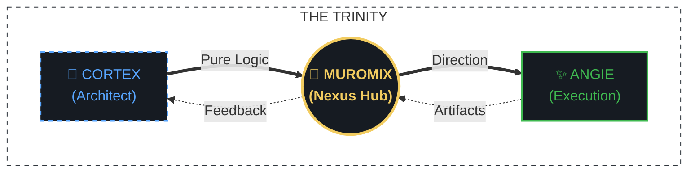

# 🎯 Focus Visualizer: The Harmony of Human & Machine Intelligence

Welcome to the future of photography workflows. **Focus Visualizer** is not just a tool; it is a manifestation of modern collaborative engineering—where human passion meets machine intelligence.

---

## 🌌 The Trinity Paradigm

This project is built upon a unique "Trinity" structure, where three specialized entities collaborate to bring complex logic into reality.

1.  **Cortex (Lead Architect)**: The source of deep logic and structural architecture.
2.  **muromix (Nexus Hub)**: The central bridge who orchestrates the collaboration and guides the project's vision.
3.  **Angie (Active Partner)**: The execution partner who handles the implementation, documentation, and user experience.

---

## ✨ Features (v0.9.5 Alpha)

- **AF Frame Visualization**: Instant visualization of Sony Alpha and Canon EOS AF coordinates.
- **Target Zoom**: One-key (Space/Shift) precision zoom that snaps exactly to the focus point.
- **Focus Peaking**: Real-time edge analysis to ensure high-speed focus checking.
- **Zero-Dependency (Win)**: Portable runtime included. No installation required.

---

## 👩‍💻 Meet the Team

*"Every line of code should be as elegant as the lens that captured the frame. We focus on the details so you can focus on the art."*

---

## ⚖️ Open Source & Ethics

This project is licensed under the **[MIT License](LICENSE)**. We believe in the friction-less sharing of tools and ideas to empower photographers worldwide.

---

## 📥 Getting Started

- **[Installation & Download](https://github.com/muromix/FocusVisualizer/releases/latest)**: Jump to the latest binary downloads.
- **[Technical Specification](SPECIFICATION.md)**: Deep dive into the logic and security.
- **[Technical README](README_TECHNICAL.md)**: Original guide with focus on technical workflow.

---

## 🐞 Bug Reports & Feedback

If you encounter any unexpected behavior, please let us know via the **[Issues](https://github.com/muromix/FocusVisualizer/issues)** tab!

## ☕ Support the Project

Focus Visualizer is a labor of love for Sony Alpha users. If you find this tool useful, consider supporting the development!

 

*(c) 2026 muromix | Synergy of Human and Machine Intelligence.*
