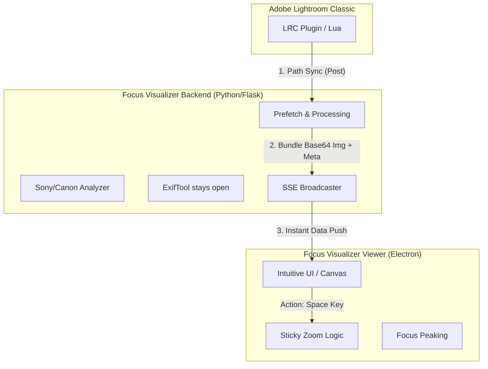

# Focus Visualizer: The Philosophy of Precision

## 🎯 1. Core Concept: "Focus on the Focus"

Focus Visualizer is not just a viewer; it is a **Decision-Making Engine** for professional photographers.

While Adobe Lightroom Classic is powerful for color and composition, determining the exact sharpness of a RAW file often requires multiple clicks and waiting for rendering. Our philosophy is to **visualize what is hidden** in the metadata—instantly.

---

## 💡 2. Why it matters

### The Problem
- **The Culling Bottleneck**: Reviewing 1,000+ photos after a shoot takes hours because checking focus requires zooming in manually for every single frame.
- **Hidden Metadata**: Cameras record exactly where they focused, but most post-processing software discards or hides this information.

### The Solution
- **Instant Visualization**: See the AF frames exactly as they appeared in your viewfinder.
- **Zero-Latency Workflow**: Sync with Lightroom in real-time. As you scroll, Focus Visualizer follows.

---

## 🚀 3. Key Pillars & Features

### I. High-Speed Review (The Engine)
- **Parallel Analysis Pipeline**: Utilizes a dual-track system. Metadata (AF frames/Camera info) is parsed via an **ExifTool Stay-Open Instance** for millisecond delivery, while a background thread extracts the preview simultaneously.
- **Zero-Latency SSE Data Push**: Eliminates traditional HTTP request overhead by bundling the Base64-encoded image preview directly into the SSE notification stream. The visual data and metadata arrive at the exact same millisecond.
- **Aggressive Buffering & Clean Environment**: Built on a consolidated Python virtual environment with intelligent neighbor prefetching to guarantee a 0ms display delay during high-speed "flipbook" culling.
- **Sticky Zoom (Logic-Driven)**: Not just a zoom; it calculates the precise normalized coordinates of the primary AF point to center the view instantly.

### II. Advanced Logistics (Analysis)
- **Multi-Brand Support**: Deep parsing for **Sony Alpha** (A7R V, A9 III, etc.) and **Canon EOS** (R5, R6 III).
- **Low-Latency Peaking**: Contrast-detection engine with <50ms latency for real-time sharpness evaluation.

### III. Architected for Pros (Reliability)
- **100% Local & Private**: No cloud, no internet. Your data never leaves your machine.
- **SSE Real-time Sync**: Flicker-free communication between Lightroom and the Viewer.
- **Cross-Platform Stealth (Win/Mac)**:
  - **Windows**: Stealth VBS launcher eliminates the "black window" (cmd prompt) during startup. Fully portable—no Python installation required.
  - **Mac**: Native `.app` bundle optimized for Silicon/Intel with intelligent app-switching logic.
- **Native Path Support**: Includes "Mojibake Rescue" logic for Windows, ensuring 100% stability even in Japanese/Multi-byte character folder paths.

---

## 🏗️ 4. Conceptual Architecture

---

## 📈 5. The Result
By using Focus Visualizer, the "Culling Phase" of photography is transformed from a chore into a high-speed, logical process. You can trust your eyes and the machine's precision simultaneously.

**Focus on the Focus. Capture the Soul.**

---
 
 

# Focus Visualizer: 精密さの哲学

## 🎯 1. コア・コンセプト：「合焦（フォーカス）に集中せよ」

Focus Visualizerは単なるビューアーではありません。プロフェッショナルなフォトグラファーのための**「意思決定エンジン」**です。

Adobe Lightroom Classicは色調補正や構図の追い込みには強力ですが、RAWファイルの正確なシャープネス（ピント）を確認するには、何度もクリックしてレンダリングを待つ必要があります。私たちの哲学は、メタデータに隠された情報を**「瞬時に可視化する」**ことにあります。

---

## 💡 2. なぜ必要なのか

### 課題 (Problem)
- **選別のボトルネック**：撮影後の1,000枚以上の写真を見返す際、1枚ずつ手動でズームしてピントを確認するのは膨大な時間を要します。
- **隠されたメタデータ**：カメラは「どこにピントを合わせたか」を正確に記録していますが、ほとんどの現像ソフトはその情報を捨て去るか、ユーザーから隠してしまいます。

### 解決策 (Solution)
- **瞬時の可視化**：ファインダーで見ていた通りのAF枠を、PC画面上に正確に再現します。
- **遅延ゼロのワークフロー**：Lightroomとリアルタイムに同期。Lightroomで写真を選ぶだけで、Focus Visualizerが即座に追従します。

---

## 🚀 3. 3つの柱と主要機能

### I. 高速レビュー (並列処理エンジンの極致)
- **並列解析パイプライン**: **ExifToolのStay-Openモード（常駐プロセス化）**を活用。ミリ秒単位でメタデータ（AF枠・撮影情報）を先行抽出し、画像展開と並列して処理するデュアル・トラック・システムを採用しています。
- **Zero-Latency SSE Data Push (パラパラ動画体験)**: Base64にエンコードされたプレビュー画像をSSEの通知ストリームに直接同梱する「データ・プッシュ」を採用。画像リクエストの往復通信を物理的に排除し、画像とメタデータを1ミリ秒のズレもなく同時に Viewer へ届けます。
- **アグレッシブ・プリフェッチとクリーンな環境**: 進行方向の画像をバックグラウンドで先読み（Prefetch）する強力なバッファリングと、プロジェクトルートに集約された単一の仮想環境により、超高速スクロール時でも「遅延ゼロ」の表示を保証します。
- **ロジック主導の吸い付きズーム**: 単なる拡大ではなく、AF情報の正規化座標を瞬時に計算。スペースキー一つで「ピント位置が画面中央に来る」よう、視線を誘導するUXを提供します。

### II. 高度な解析エンジン (Analysis)
- **マルチブランド対応**：Sony α（A7R V, A9 III等）からCanon EOS（R5, R6 III）まで、深い解析アルゴリズムを搭載。
- **低遅延ピーキング**：50ms以下の極低遅延で合焦範囲を可視化する、独自のコントラスト検出エンジン。

### III. プロ仕様の設計 (Reliability)
- **100% ローカル＆プライベート**：クラウド送信もインターネット接続も不要。大切なデータは手元から離れません。
- **SSEリアルタイム同期**：Server-Sent Eventsを採用し、Lightroomとの同期時の画面のガタつきを完全に排除しました。
- **クロスプラットフォーム・ステルス設計**:
  - **Windows**: VBSランチャーによる「黒い窓（コマンドプロンプト）」の完全非表示化。Pythonを内包したポータブル設計でインストール不要。
  - **Mac**: Apple Silicon/Intel 両対応のネイティブ `.app` 形式。OS標準のスマートなアプリ切り替えに対応。
- **日本語パス完全対応 (Mojibake Rescue)**: Windows環境特有の文字コード問題を解消。日本語を含むフォルダパスでも100%の動作安定性を保証します。

---

## 🏗️ 4. 概念的なアーキテクチャ (Conceptual Architecture)

---

## 📈 5. もたらされる結果

Focus Visualizerを導入することで、写真の「選別フェーズ」は単なる作業から、高速かつ論理的なプロセスへと進化します。フォトグラファーは、自分の目とマシンの精密さを同時に信頼することができるのです。

**合焦を見極め、魂を撮れ。**

---
*(c) 2026 muromix & Antigravity*
