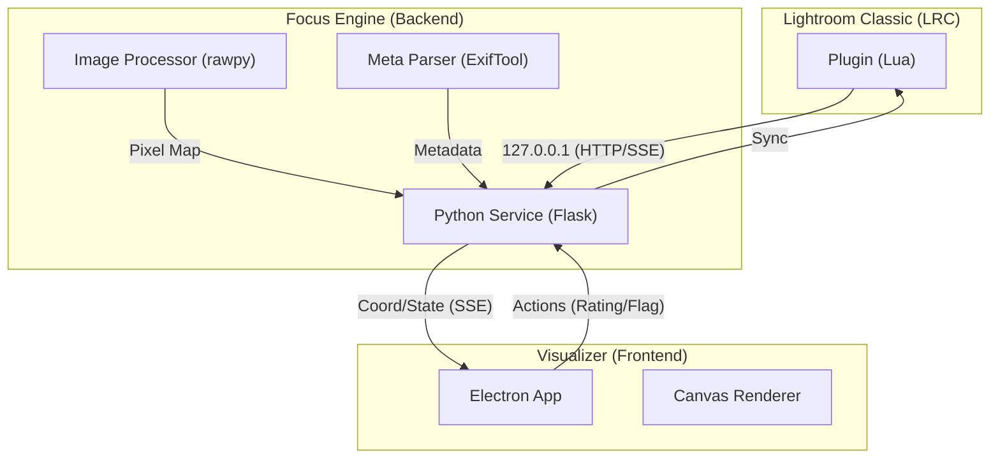

# Sony Focus Visualizer - Knowledge Portal
# Sony Focus Visualizer - ナレッジ・ポータル

Welcome to the command center of Sony Focus Visualizer's architecture. This portal connects all technical, conceptual, and operational assets.
Sony Focus Visualizerの設計哲学と技術仕様が集約されたコマンドセンターへようこそ。

---

## 🗺️ System Overview / システム俯瞰図

---

## 🌐 Language Selection / 言語選択
The Master Specification is maintained in both English and Japanese to ensure global clarity.
全体仕様書は、日英両言語で維持されています。

- 🇺🇸 **[English Master Spec (SPECIFICATION_EN.md)](./SPECIFICATION_EN.md)**
- 🇯🇵 **[日本語 全体仕様書 (SPECIFICATION_JP.md)](./SPECIFICATION_JP.md)**

---

## 🗂️ Asset Directory / 資産ディレクトリ

### 1. Vision & Concept / 理念とコンセプト
Strategic goals and the "Culling-Specialized" philosophy.
- [Concept & Philosophy](./FOCUS_VISUALIZER_CONCEPT.md) - Why we build this.

### 2. Technical Architectures / 技術設計 (v0.9.8 Update)
Deep dives into the interaction between backend, UI, and metadata.
- [UI Specification](./UI_SPECIFICATION.md) - Rendering logic, **TaskId Guard**, and shortcuts.
- [Backend Specification](./BACKEND_PYTHON_SPECIFICATION.md) - Service DI, **Universal Logging**, and worker logic.
- [Metadata Schema (UIMS v1.1)](./METADATA_SCHEMA.md) - The common language (Updated with TaskId).
- [4-Layer Metadata Fortress Architecture](./METADATA_FORTRESS_ARCHITECTURE.md) - The persistence shield.

### 3. Forensic Asset (Reverse Engineering) / 解析資産
Valuable records of Sony binary parsing and Exif interpretation.
- [Sony Tag9401 Analysis](./FACE_INFO_ANALYSIS_PROGRESS.md) - The Alpha series face-detection mystery.
- [Exif Metadata Spec](./EXIF_METADATA_SPECIFICATION.md) - Detailed tag mapping.
- [EXIF Manual (Japanese)](./EXIF_TAGS_GUIDE_JP.md) - User-friendly tag list.

### 4. Operations & Handbooks / 運用とリリース
Guides for setup and stable deployment.
- [v0.9.8 Release Note (English/JP)](./Focus%20Visualizer%20v0.9.md) - **Latest Release**.
- [Release Protocol (Master)](./RELEASE_PROTOCOL.md) - **Reproduction & Building steps**.
- [Installation Guide (EN)](./INSTALLATION_GUIDE_EN.md) - Setup for English users.
- [インストールガイド (JP)](./INSTALLATION_GUIDE_JP.md) - 日本語環境向けの手順。

---

## 🚀 Archive & Logs / 軌跡と計画
- [TODO Management](./TODO.md) - Tasks and feature requests.
- [Archive Directory](./archive/) - Completed strategies and outdated prompts.

---

**Created and Maintained by muromix & Angie**
"Code is the ultimate love letter to our future selves."
「コードは、未来の自分たちへの究極のラブレターよ。」
